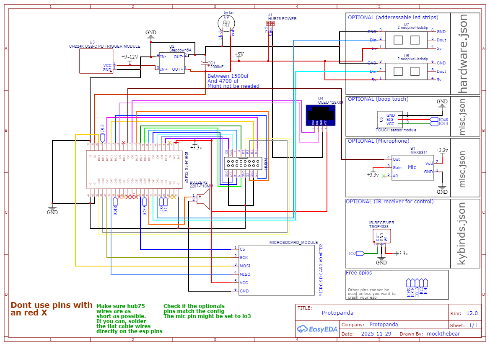

# Protopanda

__[Versão em portugues: 🇧🇷](README.pt-br.md)__

<p align="center">
  
</p>

Protopanda is an open source patform (firmware and hardware), for controling protogens. The idea is to be simple enough so all you need is just a bit of tech savviness to make it work. But at the same time, flexible enough so a person with minimum knowledge of lua can make amazing things.

**Telegram channel:** https://t.me/mockdiodes
**Telegram chat:** https://t.me/protopandachat

1. [Features](#features)
2. [3D Models](#3d-models)
3. [Guides](#guides)   
4. [FAQ](#faq)   
3. [Powering](#powering)
4. [Panels](#panels)
5. [Face and Expressions](#face-and-expressions)
6. [Compiling and flashing firmware](./doc/flashing-guide.md)
7. [LED Strips](#led-strips)
8. [Bluetooth](#bluetooth)
9. [Hardware](#hardware)
10. [DIY](#DIY)
11. [Printing and assembling guide](./doc/print-guide.md)
12. [Programming in Lua](#programming-in-lua)

# Features

- Built over ESP32-S3 N16R8. Esily avaliable and cheap
- 60+ FPS animations
- Support HUB75 Panels, MAX7219 led matrixes or WS2812 Matrixes
- RGB 16bit color depth
- Support WS2812 led stips
- Customization using Lua
- Facial expressions are just .PNG files
- Uses a SD card with easy to config settings
- BLE support for remote controlling, or IR
- USB-C powered
- Internal screen for menus
- Wifi mode where you can change configurations
- Support keyframe animation with vectorial models
- FFT built in and mouth animations based on sound
- Open source and open hardware
- Has games!
- gay 🏳️‍🌈

# 3D models

All 3d models are in thingiverse. **Note that the front frame is in a different page!**
**Head:** https://www.thingiverse.com/thing:7188042
**Front frame:** https://www.thingiverse.com/thing:7188045

[Check the FAQ here](./doc/faq.md)

# Guides


There are several guides with images and all!

* [Printing and aassembling guide](./doc/print-guide.md)
* [Building your own protopanda (DIY)](./doc/diy-guide.md)
* [Assembling the front frame with all parts](./doc/front-frame-guide.md)
* [Flashing and compiling the firmware](./doc/flashing-guide.md)
* [Configuring your protogen](./doc/configuring.md)
* [Lua function reference](doc/lua-doc.md)

# FAQ

[Check the FAQ here](./doc/faq.md)

# Powering 

__TLDR: Use a power bank that has at least 20W with PD and USB-C.__

There are two modes, one powering 5V directly from USB, and other that has some power management (buck converter), that needs from 6.5V up to 12V. This second mode is enabled only via hardware changes on the PCB.
Each HUB75 panel can consume up to 2A when maximum brightness, so powering directly from USB at 5V can be problematic, so this version with the regulator triggers the PD on the usb, requesting 9V at 3A, and this is plenty of power to light up both panels, sadly this version consumes way more power.

Since usually you wont be running them at full brightness or with all LEDs set to white, it is reccomended to use the 5V version. But some power banks cant handle the power spike upon startup. So choosing a version with PD is reccomended.


# Panels

The reccomended is to use HUB75 panels. They are driven by [mrcodetastic's hub75 lib](https://github.com/mrcodetastic/ESP32-HUB75-MatrixPanel-DMA), and these are the [recommended panels](https://pt.aliexpress.com/item/4000002686894.html).

They're multiplexed, which means only a few LEDs are on at a given time. It is fast enough that it can't be seen by the eye. But during direct sunlight, it's hard to take a good photo without screen tearing.


The resolution is 64 pixels wide and 32 pixels tall. Being two panels side by side, the total area is 128x32px. The color depth is 16 pixels, being RGB565, which means red (0-32), green (0-64), and blue (0-32).

You can also use MAX7219 matrixes or adderessable leds matrixes!


To prevent another type of tearing when a frame is being drawn while it is being updated, we enable the use of double buffering. This means that we draw pixels to the frame, but they won't appear on the screen immediately. Instead, we're drawing in memory. When we call `flipPanelBuffer()`, the memory we drew is sent to the DMA to be constantly drawn on the panel. Then, the buffer we use to draw changes. This increased the memory usage, but it's a price needed to pay.

# Face and expressions

Protopanda uses images from the SD card and a few JSON files to construct the animation sequences. All images must be in `.PNG` format; later, they're decoded to a raw format and stored in the [frame bulk file](#bulk-file).

- [Loading Frames](#loading-frames)
- [Expressions](#expressions)
- [Expression Stack](#expression-stack)
- [Bulk File](#bulk-file)
- [Managed Mode](#managed-mode)

### Loading Frames  
To load frames, add them to the SD card and specify their locations in the `animation.json` file:  

```json
{
  "frames": [
    {"pattern": "/expressions/angry/angry%d.png","flip_left": false,"flip_right": true,"from": 5,"to": 9,"name": "frames_angry"},
    {"pattern": "/expressions/angry/angry%d transition.png","flip_left": false,"flip_right": true,"from": 1,"to": 4,"name": "frames_angry_transition"},
    {"pattern": "/expressions/blink/blink%d.png","flip_left": false,"flip_right": true,"from": 1,"to": 8,"name": "frames_blink"},
  ]
}
```

> **Note:** Modifying `animation.json` (adding/removing files) forces the system to rebuild the [frame bulk file](#bulk-file).  

Each entry in the `frames` array can be either:  
- A file path, **or**  
- An object describing multiple files.  
  *(Tip: Use [this tool](https://onlinetexttools.com/printf-text) for `printf`-style patterns.)*  

#### Frame Object Properties  
- **`pattern`** (string)  
  Uses `%d` as a placeholder for numbers (like `printf`). Requires `from` and `to` fields.  
  **Example:**  
  ```json
  {"pattern": "/bolinha/input-onlinegiftools-%d.png", "from": 1, "to": 155}
  ```  
  Loads frames from `/bolinha/input-onlinegiftools-1.png` to `...-155.png`.  

- **`flip_left`** (boolean)  
  Flips the left-side frame horizontally (useful for panel orientation).  
- **`flip_right`** (boolean)  

  Flips the right-side frame horizontally (useful for panel orientation).  

- **`name`** (string)  
  Assigns an identifier to a frame or group. The name refers to the first frame in the `pattern`.  
  *Why?* Hardcoding frame orders (e.g., `[1, 2, 3]`) becomes problematic if you need to insert a new frame later on. Names act as offsets for flexibility.  

- **`color_scheme_left`** (string)  
  Flips specific color channels if needed.  
  Use any permutation of "rgb", "bgr", "rbg"

---

### Expressions  
After loading frames, [Lua scripts](#programming-in-lua) manage expressions. These are defined in `/expressions.json`:  

```json
{
  "frames": [],
  "expressions": [
    {
      "name": "normal",
      "frames": "frames_normal",
      "animation": [1, 2, 1, 2, 1, 2, 3, 4, 3],
      "duration": 250,
      "overlay": "mouth"
    },
    {
      "name": "sus",
      "frames": "frames_amogus",
      "animation": "auto",
      "duration": 200
    },
    {
      "name": "noise",
      "frames": "frames_noise",
      "animation": "loop",
      "duration": 5,
      "onEnter": "ledsStackCurrentBehavior(); ledsSegmentBehavior(0, BEHAVIOR_NOISE); ledsSegmentBehavior(1, BEHAVIOR_NOISE)",
      "onLeave": "ledsPopBehavior()"
    },
    {
      "name": "boop",
      "frames": "frames_boop",
      "animation": [1, 2, 3, 2],
      "duration": 250
    },
    {
      "name": "boop_begin",
      "frames": "frames_boop_transition",
      "animation": [1, 2, 3],
      "duration": 250,
      "transition": true
    },
    {
      "name": "boop_end",
      "frames": "frames_boop_transition",
      "animation": [3, 2, 1],
      "duration": 250,
      "transition": true
    }
  ],
  "scripts": [],
  "boop": {}
}
```

#### Expression Properties  
- **`name`** (string, *optional*)  
  Identifies the animation (e.g., for menus or scripting).  

- **`frames`** (string)  
  References a frame group from `animation.json`.  

- **`animation`** (int[] or `"auto"`)  
  - `int[]`: Explicit frame order (e.g., `[1, 2, 3]`).  
  - `"loop"`: Sequential frames (e.g., `1, 2, 3...`).  
  - `"pingpong"`: Sequential frames then reversed (e.g., `1, 2, 3...   ...3, 2, 1`).  
  - `"loop_backwards"`: Backwards Sequential frames (e.g., `...3, 2, 1`).  

- **`duration`** (int)  
  Frame display time (in milliseconds).  

- **`hidden`** (string)  
  Hide from menu selection 

- **`intro`** (string)  
  This parameter is a name of another animation that MUST be a `tranistion=true`. A animação será tocada sempre que essa expressão entrar

- **`outro`** (string)  
  This parameter is a name of another animation that MUST be a transition. This transition will play whenever the current animation stops running

- **`transition`** (boolean)  
  If `true`, the animation plays once and reverts to the previous state.  This will force the animation to stack and not remove the previous one

- **`repeats`** (int, default 1)
  If the animation is the type of a `transition`, you can set this to force it to repeat N times

- **`overlay`** (string)
  Name of the overlay to be used in that animation

- **`onEnter`** (string, Lua code)  
  Executes when the animation starts.  

- **`onLeave`** (string, Lua code)  
  Executes when the animation ends (either due to `transition=true` or interruption).  

## Overlays

Sometimes you want something with a little more swag. Like a mouth that moves as you speak, or some stars, or even something that reacts by an accelerometer. For that you can create overlays:


```json
{
"overlays"   : [
    {
      "name"    : "stars",
      "elements": [
        {
          "sprites"           : [
            "/expressions/overlays/star.png"
          ],
          "transparency": true,
          "transparency_color": "#ff00ff",
          "animation"         : {
            "mode": "random_flashing",
            "alive_duration": 50,
            "interval_min": 100,
            "interval_max": 500,
            "min_x": 0,
            "max_x": 64,
            "min_y": 0,
            "max_y": 64
          }
        }
      ]
    }
    {
      "name"    : "mouth",
      "elements": [
        {
          "sprites"           : [
            "/expressions/overlays/mouth0.png",
            "/expressions/overlays/mouth1.png",
            "/expressions/overlays/mouth2.png",
            "/expressions/overlays/mouth3.png",
            "/expressions/overlays/mouth4.png"
          ],
          "transparency": false,
          "transparency_color": "#000000",
          "animation"         : {
            "mode": "fft",
            "x": 11,
            "y": 19,
            "band_start": 2,
            "band_end": 8,
            "attack": 0.05,
            "release": 0.2,
            "min_energy": 50000,
            "max_energy": 200000,
            "frist_frame_threshold": 60000
          }
        }
      ]
    }
  ]
}
```


## Expression stack

The expressions are stored in a stack. So when you add an animation that doesn't repeat, it will pause the current animation and run until the end of the new animation. If you add two at the same time, the last one will be executed. When it finishes, the previous one will run.

## Bulk file

Even with the SD card, changing frames is not quite fast. The SD card interface is not fast enough. To make it faster, the images are PNG decoded to raw pixel data stored in RGB565 format inside the internal flash. All frames are stored in a single file called the `Bulk file`. This is done in a way that the frames are stored sequentially, and by keeping the file open, the transfer speed is accelerated, achieving 60fps.
Every time you add or modify a new frame, this file must be rebuilt. This can be done in the menu or by calling the Lua function `composeBulkFile`.

## Managed mode

The animations are processed by Core 0, so you don't have to waste any precious time on the [lua scripts](#programming-in-lua) updating it. 
It is possible to change the frame using Lua scripts... But it's also wasteful. So leave it to the other core, and you only have to worry about selecting which expressions you want!
During managed mode, the frame drawing is handled by Core 0.


# Compiling

Full guide here: [Compiling and flashing firmware](./doc/flashing-guide.md)

# LED strips

Protopanda supports the WS2812B adderessable LED protocol and it provies a simple crude system to defining a few behaviors for the strip/matrices


You can define them inside `hardware.json`:
```json
{
  "leds": { 
    "pin_mode": "double",
    "_comment": "Modes allowed are: 'double' and 'single'. If using extra led strips, they'll all attach at the right led pin if double is set",
    "groups":[
      {
        "_comment": "If pin_side is undefined, it defaults to 'left'",
        "pin_side": "left",
        "led_count": 64,
        "mode": "pride"
      },
      {
        "pin_side": "right",
        "led_count": 64,
        "mode": "pride"
      }
    ]
  }
}
```

### Available Modes and Parameters

| Mode | Description | Parameters |
|------|-------------|------------|
| `none` | LEDs remain off | None |
| `pride` | Rainbow pride flag animation | None |
| `rotate` | Rotating color along the strip | `speed` (ms) - rotation speed |
| `random_color` | Each LED flashes random colors | None |
| `fade_cycle` | Gradual color cycling | `hue` (0-255), `speed` (ms), `min_brightness` (0-255) |
| `rotate_fade_cycle` | Fade cycle with rotation | `hue`, `speed`, `min_brightness`, `rotate_speed` (ms) |
| `color_rgb` | Static RGB color | `r` (0-255), `g` (0-255), `b` (0-255) |
| `color_hsv` | Static HSV color | `h` (0-255), `s` (0-255), `v` (0-255) |
| `random_blink` | LEDs blink randomly | `base_hue` (0-255), `hue_variance` (0-255), `brightness` (0-255), `blink_speed` (ms) |
| `icon_x` | Display an "X" pattern | None |
| `icon_y` | Display a "Y" pattern | None |
| `icon_v` | Display a "V" pattern | None |
| `rotate_sine_v` | Sine wave brightness variation | `hue` (0-255), `saturation` (0-255), `speed` (ms) |
| `rotate_sine_s` | Sine wave saturation variation | `hue` (0-255), `brightness` (0-255), `speed` (ms) |
| `rotate_sine_h` | Sine wave hue variation | `sat` (0-255), `brightness` (0-255), `speed` (ms) |
| `fade_in` | Gradual fade-in effect | `hue` (0-255), `saturation` (0-255), `step` (0-255), `delay` (ms) |
| `noise` | Random noise effect | `step` (0-255), `delay` (ms) |


# Bluetooth  

Since version 2.0, Protopanda supports almost any kind of BLE device that has HID. All you need to do is adapt the driver if needed or write a new one. Currently the devices supported are:
* https://github.com/mockthebear/ble-fursuit-paw
* https://pt.aliexpress.com/item/1005008459884910.html
* https://pt.aliexpress.com/item/1005009845485445.html

A BLE joystick works best.

## Keybind

Currently the default keybinds are
```json
{
  "keybinds":{
    "joystick.right_hat=5": "BUTTON_LEFT",
    "joystick.right_hat=3": "BUTTON_DOWN",
    "joystick.right_hat=1": "BUTTON_RIGHT",
    "joystick.right_hat=7": "BUTTON_UP",
    "joystick.buttons.4": "BUTTON_CONFIRM",
    "joystick.buttons.1": "BUTTON_BACK",

    "beauty.buttons.4": "BUTTON_LEFT",
    "beauty.buttons.1": "BUTTON_DOWN",
    "beauty.buttons.3": "BUTTON_RIGHT",
    "beauty.buttons.2": "BUTTON_UP",
    "beauty.buttons.5": "BUTTON_CONFIRM",
    "beauty.buttons.6": "BUTTON_BACK"

  }
}
```
They all map by default for the BLE fursuit paw

# Hardware

Protopanda is designed to run on Esp32s3-n16r8, which is a version with 16MB Flash, 384kB ROM, 512 Kb RAM, and 8MB octal PSRAM.
This specific version is required because its extra space and PSRAM provide enough RAM to run the panels, BLE, and [lua](#programming-in-lua) together.

On the hardware, there is a port for the HUB75 data, an SD card connector, two screw terminals for the 5V out, the power in pins, one I2C port, and the LED strip pin.

## Diagram


## Ports


## Schematic


## Two cores
Protopanda uses and abuses the two cores in the ESP32.  
* **Core 0**
By default, Core 0 is primarily designed to manage Bluetooth. When not doing so, it manages the animations, and when [Managed mode](#managed-mode) is active, it also handles the LED screen updating.
* **Core 1**
The second core handles non-screen-related tasks. It has the routine that checks the [power level](#powering), updates the inputs, reads sensors, and calls the Lua function onLoop.


## DIY

We know not all of us can build a PCB from scratch, so I'm providing a way you can build your own reduced version of protopanda. 
Well, we have a [guide for making your own protopanda!](./doc/diy-guide.md)

  

#### Remote controller

To control you can:
* Use a protopanda controller built with a NRF52832.
* Use an IR controller and write a driver for it.
* [Buy one of those BLE devices that are compatible and have a driver already](https://pt.aliexpress.com/item/1005008459884910.html?)
* Write your own solution using the two extra gpios left.


# Printing and assembly guide
[Guide here](./doc/print-guide.md)

# Programming in Lua

__[Lua functions reference](doc/lua-doc.md)__


- [Minimum Lua Script](#minimum-lua-script)
- [Cycle Expressions Each Second](#cycle-expressions-each-second)

## Minimum lua script
```lua
--Minimum lua script on init.lua

function onSetup()
  --Function is called once, here you may start the BLE, begin scanning, configure panel, set power mode, load lib and prepare led strips and even power on
  --All calls here are called from SETUP, running on core 0
end

function onPreflight()
  --Upon here, the all lua calls are called from core 1. You can even leave this function in blank.
  --Core 0 will only start managing after 100ms (the final beep)
end

function onLoop(dt)
  --This function will be called in loop. 
  --The dt parameter is the difference in MS from the begin of the last frame and current one. Useful for storing elapsed time
end
```
## Cycle expressions each second
```lua
local expressions = dofile("/lualib/expressions.lua")
local changeExpressionTimer = 1000 --1 second

function onSetup()
  setPanelMaxBrightness(64)
  panelPowerOn() --Brightness always start at 0
  gentlySetPanelBrightness(64)
end

function onPreflight()
  setPanelManaged(true)
  expressions.Next()
end

function onLoop(dt)
  changeExpressionTimer = changeExpressionTimer - dt 
  if changeExpressionTimer <= 0 then 
    changeExpressionTimer = 1000 --1 second
    expressions.Next()
  end
end
```
