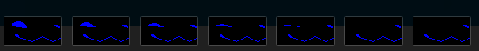
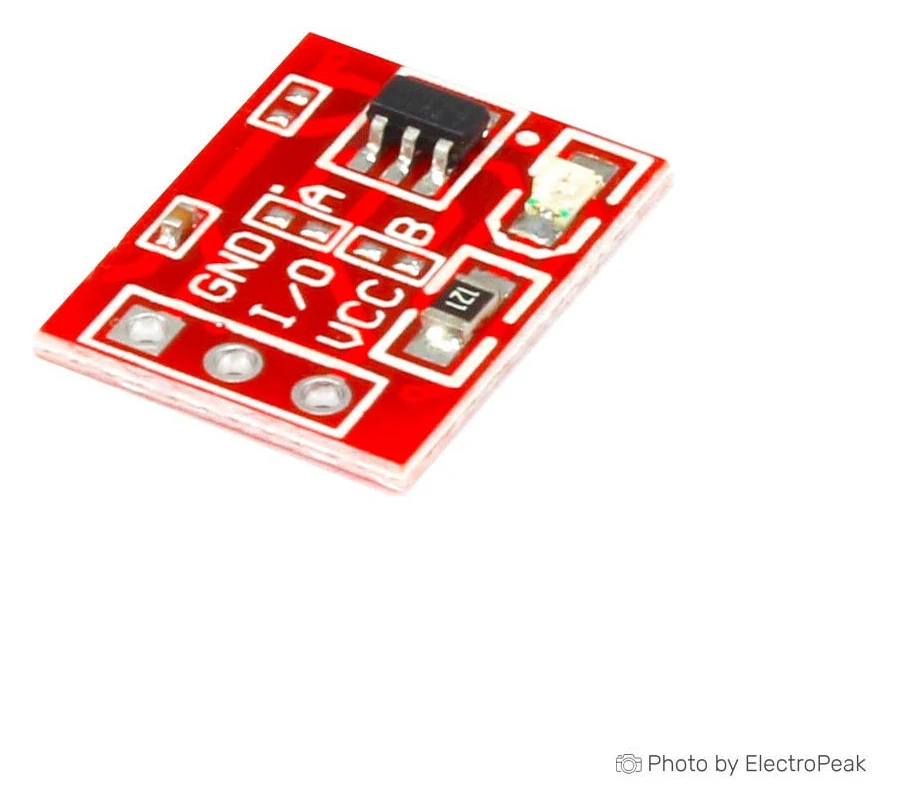
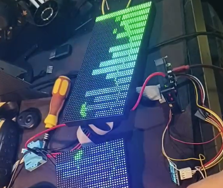
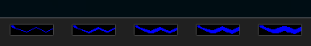
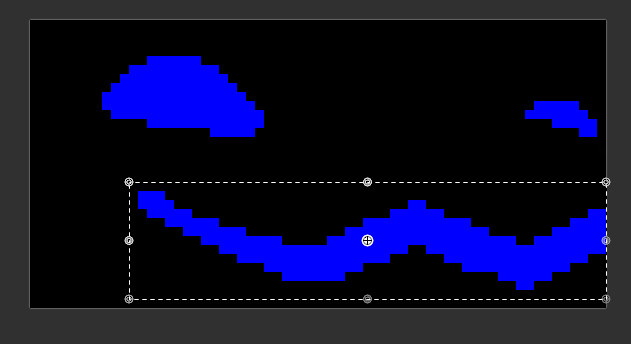

# Configuring

First of all. This page is dedicated to the configurations of your protogen. Some configurations are defined in the source code. These configurations will not be talked here. 

> Anything in this guide will be considering a unmodified version of the firmware.

> For all parts of these guides, they will consider you have a unmodified version of protopanda. 

> Some settings are enabled/disabled in your protogen menu. Going on the `settings`

# Topics

1. [Creating facial expressions](#expressions)
2. [Modifying the boop](#boop)
3. [Microphone, FFT and mouth movement](#microphone)
4. [Changing input method](#input)
5. [Changing side leds color](#leds)
6. [Changing display (moving to MAX7219)](#display)
7. [Creating scripts](#scripts)


# Expressions

The whole point of protopanda is beeing easy to create expressions, and now you'll see how easy it its. 

For animation overlays or mouth movement based on microphone, check the over [overlay section at the microphone part](#overlay)

## Inner workings

Everything will be configured inside the `animation.json` file. The two important parts we need on this file are: 

* frames
* expressions

The innerworkings of protopanda are planned to draw those animations and jump between them without any delay or loading. To do so in a rather weak hardware some tricks were needed. 
To draw an animation, first we need the pixels on it. Loading images and decoding the compressed data from the SD card takes time. Like alot of time, if we did that while the protogen runs we would be limited to like 5fps.

To speed up things, we load all images once, decode them all and store in a kind of "bigger image" or an [texture atlas or spritesheet](https://en.wikipedia.org/wiki/Texture_atlas). Loading a whole texture atlas would probally eat all the RAM on the poor Esp32, so we need to load each individual image, one at a time.

Once those images are loaded and stored inside the internal flash of the esp32 (way way faster than SD card), we simply need to say:
- Draw this section here
- Now draw this other section
- Now this other ones preety please?

Saying sounds hard but doing so with the existing codebase super easy. With all sprites loaded, all we need is to specify the animation order, and how long each frame should stay in the screen.

So, lets get to work!

## Frame creating.

To create a frame, first open your favorite image editor. I love using the windows paint for that. You can use [aseprite](https://www.aseprite.org/) or [paintnet](https://paint.net/) for that too.

Start with a 64x32 pixels image. Then make the background all black. I mean BLACK RGB 0,0,0 #000000! 

Then draw your protogen face there


Save that as `happy1.png`. Then create another, but change a little. Change to what? Idk, go crazy, experiment, try what your heart desires.



Say we named it "happy1.png", "happy2.png" ... until "happy7.png"

We need to move it to the sd card. Once in the SD card, open your favorite text editor he file `animation.json` and add the following part:

```json
{
  "frames"     : [
        {
        "files"   :  ["/happy1.png", "/happy2.png", "/happy2.png", "/happy3.png", "/happy4.png", "/happy5.png", "/happy6.png", "/happy7.png"],
        "name"      : "happy_frames"
        },
    <The rest of the animation.json>
```

The bare minimum you need in a frame object is which files you wanna load and the name.

Not that we need to ALWAYS start the path with a `/`. If you saved the images at the folder `expressions` it would look like `/expressions/happy1.png`.

Now save and put the SD card back on the protogen. On the startup if you havent fucked up the [JSON syntax](https://developer.mozilla.org/en-US/docs/Learn_web_development/Core/Scripting/JSON), a loading bar will show up. 
**Every time you add or remove frames, that process will happen.** Once it finishes, behold, NOTHING CHANGED.

Thats because only created the frames, duh. We need to say how it is going to play.

Back to the `animation.json`, lets review some things before we actually make some animations

#### File loading

Say you dont wanna type each individual name on the json. There is a pattern on the name right? happy(number).png. We can use that!

```json
{
  "frames"     : [
        {
        "pattern"   :  "/happy%d.png",
        "from"      : 1,
        "to"        : 7,
        
        "name"      : "happy_frames"
        },
    <The rest of the animation.json>
```
This will do the same as the json we did first. But we replaced the number with `%d` and we say from which it starts and when it ends. Thats a `sprintf` notation. You can use [this tool](https://onlinephp.io/sprintf) to help with that.

#### Flipping

If you load and play the frames loaded, you will notice that right side of the screen the image will be flipped. Thats because they will be draw twice, and one of the screens we physically folded to the other side. So we need to flip it!

```json
{
  "frames"     : [
        {
        "pattern"   :  "/happy%d.png",
        "from"      : 1,
        "to"        : 7,
        "flip_left" : false,
        "flip_right": true,
        "name"      : "happy_frames"
        },
    <The rest of the animation.json>
```

Thats how you do it, and its reccomended that you always put those two if the image dont contains a text.

#### Color scheme by side.

Maybe you want your proto to have heterochromia? Like one side with different colors? By default all images are loaded like they're an RGB image. But you can specify to be drawn as RBG... or BGR, or GRB...? 
Not a conventional thing, but supported nontheless. For that you just need to add:
```json
{
    <the rest of your frame section>
    "color_scheme_right": "rgb",
    "color_scheme_left": "rbg"
}
```
For the next examples, we will conside you didn't added that.

## Animation creating

Now that we have the frames loaded, remember the name you defined. Go to your `animation.json` at the `expressions` section. 
Lets add a basic animation. We have 7 frames. 

```json
{
    "frames": [
        {
        "pattern"   :  "/happy%d.png",
        "from"      : 1,
        "to"        : 7,
        "flip_left" : false,
        "flip_right": true,
        "name"      : "happy_frames"
        },
        <all your frames>
    ],
    "expressions": [
        {
        "name"     : "happy",
        "frames": "happy_frames",
        "animation": [1,2,3,4,5,6,7],
        "duration" : 75
        },
        <the rest of your expressions>
```
We basically saying:
"Using the frames `happy_frame` lets play sequentially from 1 to 7. Each frame will be for 75 milliseconds on the screen. And on the expression selection menu, the name of this expression will be `happy`.

> The first frame will always be 1.  No matter if you set `from: 10, to: 15`, it will be `1,2,3,4,5`.

Thats it! You have your first animation. Turn on your proto and test it!

### Presets

Sometimes you draw like 20 frames and you're like: heck, i'll have to do this?
```json
[1,2,3,4,5,6,7,8,9,10,11,12,13,14,15,16,17,18,19,20],
```
The awnser is, **not always**!
There are a few presets, in this specific case you can just replace it with `loop`:
```json
    {
        "name"     : "happy",
        "frames": "happy_frames",
        "animation": "loop",
        "duration" : 75
    }
```
That way the code will do a looped animation. 

| Macro name     | Behavior                                                                                                             |
|----------------|----------------------------------------------------------------------------------------------------------------------|
| auto           | Play from the first until the last frame, when warps back to the first frame: 1,2,3,4,5,6,7 then again 1,2,3,4,5,6,7 |
| loop           | Same as auto                                                                                                         |
| pingpong       | Play from the first frame, until the last, then play the animation backwards: 1,2,3,4,5,6,7,6,5,4,3,2,1 then repeats |
| loop_backwards | Just like loop, but starts at the last and plays to the first.                                                       |

### Tansitions

Say you want to make a smooth transition between two animations.

Happy -> Sad

For that, you need a third animation:

Happy -> Happy-to-Sad -> Sad

```json
    {
        "name"     : "happy",
        "frames": "happy_frames",
        "animation": "loop",
        "duration" : 75
    },
    {
        "name"     : "hayyp-to-sad",
        "frames": "happy_to_sad_frames",
        "animation": "loop",
        "duration" : 75
    },
    {
        "name"     : "sad",
        "frames": "sad_frames",
        "animation": "loop",
        "duration" : 75
    }
```

Once you swap the animations, say by a boop or changing in the menu, you need this happy-to-sad to play at least once and then play sad after. So for that you will add this to the sad animation:

```json
    "intro": "hayyp-to-sad"
```

This way, when you start playing sad, the into animation will play once until the end, then `sad` enters.

You can even do this:

```json
    {
        "name"     : "happy",
        "frames": "happy_frames",
        "animation": "loop",
        "duration" : 75
    },
    {
        "name"     : "hayyp-to-sad",
        "frames": "happy_to_sad_frames",
        "transition": true,
        "animation": "loop",
        "duration" : 75
    },
    {
        "name"     : "hayyp-to-sad",
        "frames": "sad_to_happy_frames",
        "transition": true,
        "animation": "loop_backwards",
        "duration" : 75
    },
    {
        "name"     : "sad",
        "frames": "sad_frames",
        "animation": "loop",
        "intro"    : "happy_to_sad_frames",
        "outro"    : "sad_to_happy_frames",
        "duration" : 75
    }
```

This way the animation will play oince it starts and when it leaves. 
Also good idea to add `"transition": true,` to all animations that are just transitions. With that value set to true, those animation wont show up on the expression selection.

### Scripts on animations

Since the whole animation system runs mostly on the C++ part of the code, the menus and selection are in lua, therefore we can run some code when the animation is selected. We can use:

```json
    {
        "name"     : "sad",
        "frames": "sad_frames",
        "animation": "loop",
        "intro"    : "happy_to_sad_frames",
        "outro"    : "sad_to_happy_frames",
        "duration" : 75,
        "onEnter": "tone(440)",
        "onLeave": "tone(1440)"
    }
```

That way when we select the sad animation, the buzzer of the proto will make a beep in a lower pitch and when leaving it will sound a higger pitch.


## First animation on boot

Once your protogen boots, the first animation to be played is defined in the `misc.json` as `"starting_animation": "normal",`.
To change to your new animation, the `happy` one just set it as:

`"starting_animation": "happy",`


# Boop

The whole boop logic is defined in the `misc.json`. The default ones are: 

```json
{
    "boop": {
        "//comment": "The trigger_mode can accept either 'gpio' or 'lidar'",
        "trigger_mode": "gpio", 
        "gpio": 48,
        "power_gpio": 13,
        "gpio_state": 1,
        "enabled": true,
        "boopAnimationName": "boop",
        "transictionOnlyOnAnimation": "normal",
        "transictionInOnlyOnSpecificFrame": 1
    }
```

We go trough each setting. First there are two modes for the boop activation. Those are **gpio** and **lidar**. Lidar is highly not reccomended and is beeing deprecated, so we're not talking about it.

## Boop as GPIO

You're probally familiar with the word [GPIO](https://en.wikipedia.org/wiki/General-purpose_input/output), when this mode is enabled, we decide when the booping is active when a certain gpio is in a certain state.

Since the guide reccomend using the GPIO 48 and a touch sensor ttp223

Once you're touching it, it sends a HIGH signal on its output. So we detect when its high.

Therefore:
```json
{
        "gpio": 48,
        "gpio_state": 1,
        "enabled": true, //Yes we using the sensor >.>
}
```
Those sensors are finnicky, and if you turn on your proto while holding near the touch sensor, it might stay stuck saying: "hey something is touching". That is no good, thats why the code is smart enough to detect that when the sensor is on for too long, we should turn it off. Thats why on the guide we say to wire GPIO 13 to the VCC of the sensor.  

* `"power_gpio": 13,`

## Boop animation

Now we wanna say: Hey, when the boop is triggered, please go to animation `sad`.

For that, we just need to do this:

```json
{
        "gpio": 48,
        "gpio_state": 1,
        "power_gpio": 13,
        "enabled": true, 
        "boopAnimationName": "sad"
}
```

Done. Thats it. 

> Intros and outros will play aswell here.

But lets say you wanna do something a little more polished. Lets say you have a blue screen of death animation and other ones that if you simply go to the boop animation would look wierd. Thats why you can add this:

* `"transictionOnlyOnAnimation": "happy",`

That way, only when `happy` is playing that the boop will be triggered.

But lets say you made the proto blink the eye and dont want the animation to start playing while his eyes are closed. Thats why you add this:

* `"transictionInOnlyOnSpecificFrame": 1`

Now only when the animation is at the first frame the boop animation will start playing.

# Microphone

Protopanda does not have support for voice modulation or voice recording. So the microphone is used only for mouth movement and FFT.

Any free gpios between 1 and 9 can be used as microphone. The default one is pin 3.  
The mic config sits at the `misc.json`

```json
{
    "fft": {
        "gpio": 3,
        "samples": 512,
        "sampling_frequency": 44100,
        "noise_threshold": 5500,
        "band_count": 32,
        "speech_band_start": 2,
        "speech_band_end":  8,
        "speech_min_energy": 50000,
        "speech_max_energy": 200000,          
        "speech_frist_frame_threshold": 40000,
        "enabled": true
    }
```

## FFT

Here is a bit complex, even for people who are used to software development. Its a part of signal processig, called Fourrier Transformation.
We use one called [Fast Fourrier Transformation](https://pt.wikipedia.org/wiki/Transformada_r%C3%A1pida_de_Fourier). Which basically gets the audio data and transforms it in to the basic frequencies that sound compose.

What the heck? Why you telling me this?!
Well, This is the FFT running and displaying the result on the panel:



Some people call that "audio visualizer" or "rave mode". That is the basis for the voice reactive expressions.

You can turn on that overlay going in your proto settings and searching for `FFT [OFF]`.

### FFT Parameters

Now it gets a bit complex. To do a propper FFT, we need to sample some data from GPIO 3 (default) at a certain [sample rate](https://en.wikipedia.org/wiki/Sampling_(signal_processing)).

By default we sample at 44100Hz `"sampling_frequency": 44100,`. Also we allocate 2x 512 floats to store that data `"samples": 512,`.
Always using two buffers, so technically, 1024, a total of 4kb. **Mind the free heap size when changing this number**.
Some values are not accepted and they need to be multiple of 2. In case of fail to initialize FFT, check the logs, there will be information about why it was rejected. Thats an ESP32 API requirement.

With each sample we need to do the analysis. The parameters for the FFT are:
```json
{
    ...
    "noise_threshold": 5500,
    "band_count": 32,
    ...
}
```

You can increase the band count to make things smoother. I find 32 a good amount for what is needed. But you can increase as you desire. To avoid noise, you can increase or decrease that threshhold. It will cut off any values under that and not account them for the FFT band value. 
That threshold can be also changed during runtime at **settings>microphone config**.

### Microphone calibrating

Inside the settings, there is an option to calibrate. Its a straightforward procedure. But basically it uses your speech to try and find a certain frequency range and noise on your envoriment to make the mouth move accordingly. There are default values in this section of FFT, but as soon as you change something in the microphone config, they will always be overwritte:

```json
{
    ...
        "speech_band_start": 2,
        "speech_band_end":  8,
        "speech_min_energy": 50000,
        "speech_max_energy": 200000,          
        "speech_frist_frame_threshold": 40000,
    ...
}
```

But whats up there saying is:

We will consider only from band 2 to 8 as where the speech frequencies are, anything after that is discarded.
Then we will sum the value on each band and get an "energy" value.

The we smooth the energy level between each frame using:

$$\alpha = 1 - e^{-\Delta t / \tau}$$

$$E = E_{prev} \cdot (1 - \alpha) + E_{cur} \cdot \alpha$$

To start even checking we first check if the energy is bigger than `speech_frist_frame_threshold`. 

Once it is bigger, we can start checking for triggering. 

Tau is defined as:
```lua
local tau = (currentEnergy > _M.lastEnergyLevel) and 0.05 or 0.2
``` 

Now, if the energy gets at least to `speech_min_energy`, then we will change the trigger to true ans set as level 2.
As the energy level goes up, the level keeps increasing until we reach `speech_max_energy`. 

Whats that level? Well, its an arbitrary number we can define. Right now the level is define as the frame id of the mouth animation we use. But it can be any number.

## Overlays

Overlays are sprites drawn over the current playing animation. Those sprites can be controlled using Lua. They all stay in the `animation.json`.

Honestly, the whole section for overlays deserve a dedicated guide section, so we're just covering the mouth movement for now.

### Mouth movement overlay

At the `overlays` section, this is the mouth movement definition:

```json
{
    "overlays"   : [
        {
        "name"    : "mouth",
        "elements": [
            {
            "sprites"           : [
                "/expressions/overlays/mouth1.png",
                "/expressions/overlays/mouth2.png",
                "/expressions/overlays/mouth3.png",
                "/expressions/overlays/mouth4.png",
                "/expressions/overlays/mouth5.png"
            ],
            "transparency": false,
            "behavior"         : {
                "mode": "frame_by_fft_level",
                "push_to_talk_button": "BUTTON_BACK",
                "x": 11,
                "y": 19,
                "attack": 0.05,
                "release": 0.2
            }
            }
        ]
        }
    ]
}
``` 

Behind the curtains what it does is basically feed to the FFT controller saying:
"The levels go from 1 to 5", just give me the current level.

So baically here, you specify the frames of the mouth, as they open based on the levels



And then we specify where it should be drawn over.




# Input

Protopanda was made to be controlled. Like change animations, navigate trough menus, play games. So for that we need to set a input mode.

By default, we use [Bluetooth low energy (BLE)](https://en.wikipedia.org/wiki/Bluetooth_Low_Energy), but you can also use a infrared remote if you wire things propperly. 

At the `keybinds.json`, you will find this:

```json
{
  "input": {
    "//comment0": "The current avaliable input modes are 'infrared', 'ble' and 'none'",
    "mode": "BLE",
    "//comment1": "'enableHidControllers' allows for generic controllers like BLE HID devices to connect with protopanda. Support is limited",
    "enableHidControllers": true,
    "pairController": true,
    "maxBleDevices": 1,
    "drivers": ["panda", "BLE-M3", "beauty-r1"]
  },
```

There you can change the input mode.

## BLE

For bluetooth low energy, you will need these directives inside the input:

```json
{
    "mode": "BLE",
    "enableHidControllers": true,
    "pairController": true,
    "maxBleDevices": 1,
    "drivers": ["panda", "BLE-M3", "beauty-r1"]
}
```

Ideally, you would only use the protopanda controller, the one that is built over NRF52832 with custom code and all. Thats the ideal. But not evebody is capable of doing it since its not a begginer friendly alternative. You can hack something using another esp32 but thats also a long way to get there. 

So most of the people who go trough the DIY route will use the reccomended controllers. Those controllers are just BLE mouses and keyboards. Like, literally, they seems to be just a handheld keypad, but its simulating a mouse. 
Any device that presents itself as a HID device will be able to connect to protopanda when `"enableHidControllers": true,` is enabled. Whether that device will be fully supported by the code is another question. 

When you first boot protopanda, it will require a controller to be paired. In other words it will startup in the pairing mode because of `"pairController": true,`. Disabling that, the protopanda will stay all the time looking for the controller (scanning). Not ideal, specially in a furcon. You can accidentally connect to someone's else mouse or keyboard.

Also yes, protopanda support more than one controller connected at the same time, up to four. `"maxBleDevices": 1,`. Unless you have a really specific use, no reason to increase that.

Protopanda has a kind of 'diver' scripts to handle specific BLE devices. Right now, the HID is defined as a basic driver. Therefore other drivers can increment its behavior. Thats why the 'BLE-M3' and the 'beauty-r1' are there. Those are dumb devices that simulate the movements of a mouse. Their sole porupose is to doomscroll for you while you press buttons. The drivers simply identify the packages and find the pattern of each button.

For the 'protopanda' driver, it actually handles the connection, send and receives messages. The script of each driver statys in the sd card at `/lualib/drivers`.

This is the basic of a driver:

```lua
local panda = {
	type="core",

	mode = {
        'panda'
    },
}

function panda.onSubscribeMessagePanda(connectionId, clientId, data)
    --Parse data
end

function panda.onDisconnectPanda(connectionId, controllerId, reason)
    log("Disconnected "..connectionId.." due ".. reason)
    drivers.DisconnectDevice(controllerId, 'panda')
end

function panda.onConnectPanda(connectionId, controllerId, address, name)
    drivers.ConnectDevice(controllerId, address, "panda")
    panda.handler:WriteToCharacteristics({0,0,0,controllerId}, connectionId, "d4d3fafb-c4c1-c2c3-b4b3-b2b1a4a3a2a1", true)
end


function panda.onEnable()
    panda.handler = BleServiceHandler("d4d31337-c4c1-c2c3-b4b3-b2b1a4a3a2a1")
    panda.handler:SetOnConnectCallback(panda.onConnectPanda)
    panda.handler:SetOnDisconnectCallback(panda.onDisconnectPanda)
    panda.pandaListener = panda.handler:AddCharacteristics("d4d3afaf-c4c1-c2c3-b4b3-b2b1a4a3a2a1")
    panda.pandaListener:SetSubscribeCallback(panda.onSubscribeMessagePanda)
    panda.pandaListener:SetCallbackModeStream(true)
    return true
end

return panda
```

## Infrared controller

When mode is defined to infrared, then all the BLE settings are useless, but the `infrared` directive at the root of `misc.json` is now mandatory:


```json
{
  <input directive>
  "infrared": [
    {
      "//comment": "Generic controller",
      "usercode": "FF00",
      "bind": {
        "B9": "press(BUTTON_UP)",
        "EA": "press(BUTTON_DOWN)",
        "BB": "press(BUTTON_LEFT)", 
        "BC": "press(BUTTON_RIGHT)",
        "BF": "press(BUTTON_CONFIRM)",
        "E6": "press(BUTTON_BACK)",
        "BA": "press(BUTTON_AUX_A)",
        "F3": "setRainbowShader(true)",
        "E7": "setRainbowShader(false)",
        "F7": "expressions.Next()",
        "E3": "expressions.Previous()",
        "A5": "press(BUTTON_BACK, 1)"
      }
    }
  ]
}
```

Simply put, each infrared remote [sends a packet of data](https://learn.sparkfun.com/tutorials/ir-communication/all) when you press a button. Usually this data packet is composed of a usercode and button id.
You can use a decoder or get the opcodes of your controller at the internet. Also its easy to code something in a arduino to just dump those opcodes. 

But thats too much work right? Just point your remote to protopanda IR receiver and press a button. If you're in the serial monitor (or checking the logs later) you will see a message like this:
> Unmapped IR command with usercode FFBC and opcode F9

There we go! You have all the data. Lets say you pressed in the order: up, down, left, right, enter, back, and you got:

> Unmapped IR command with usercode FFBC and opcode F9
> Unmapped IR command with usercode FFBC and opcode F8
> Unmapped IR command with usercode FFBC and opcode F7
> Unmapped IR command with usercode FFBC and opcode F6
> Unmapped IR command with usercode FFBC and opcode F5
> Unmapped IR command with usercode FFBC and opcode F4

So you just do this:

```json
{
  <input directive>
  "infrared": [
    {
        <the other IR controller>
    },
    {
      "//comment": "My new controller ^.^",
      "usercode": "FFBC",
      "bind": {
        "F9": "press(BUTTON_UP)",
        "F8": "press(BUTTON_DOWN)",
        "F7": "press(BUTTON_LEFT)", 
        "F6": "press(BUTTON_RIGHT)",
        "F5": "press(BUTTON_CONFIRM)",
        "F4": "press(BUTTON_BACK)",
      }
    }
  ]
}
```

See? Easy enought!

You can even do something more complex like:

```json
"F3": "expressions.Next()",
```

That text section is just a lua code. So go crazy!
