# Remote controller

Protopanda **REQUIRES** you to have a way to control it. Yes  you can cycle animatyions pressing the "boot" (GPIO 0) button, and you can hack some button on the avaliable GPIOS... Thats not the intended way.

Also yes, there is the android app. It is handy since you dont need to build or buy anything extra, but during the convention its a bit awkward right? Therefore we are here to build one!

Unlike the protopanda controller, here you have alot of room to make mistakes and **alot** of room to make customizations. 

## Board versions

Currently the supported code is for those micro controllers:

* NRF52840
* NRF52832
* Esp32 SuperMini

I dont reccomend the esp32 because it is super power hungry, but its a platform most of makers have used before.
The ideal MCU would be NRF52832, its a ultra low power chip, it can last weeks/months during deep sleep in a single CR2032 cell, but it does require an external flashing device.
The sweet spot is NRF52840, uses significantly more power than NRF52832 but still can last days in a single CR2032 and dont require an external flashing device.

## What are we building

The gist of it is this:

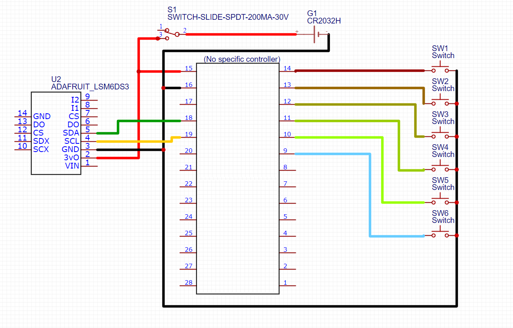

A battery, a switch, the controller, an accelerometer and 6 buttons. Thats it.

## Materials

For this guide, we're using NRF52840. You can chose other controller, as long it has BLE and you modify the pins accordingly.

### NRF52840 Variants

There are 3 variants. The guide photos will cover the cheaper variant. But the other two works out of the box, you just need to solder the correct pins.

#### Cheaper

[Nice!Nano V2.0](https://s.click.aliexpress.com/e/_c3xJ6Eat)

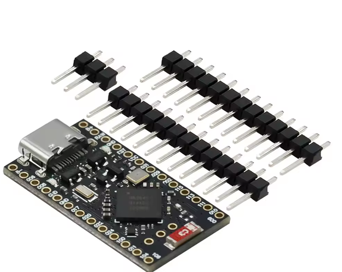

This board is the biggest one in comparsion o the other two variants. But its by far the cheapest one.

#### Small but on budget

[XIAO nRF52840 Plus](https://s.click.aliexpress.com/e/_c4FMNzzF)

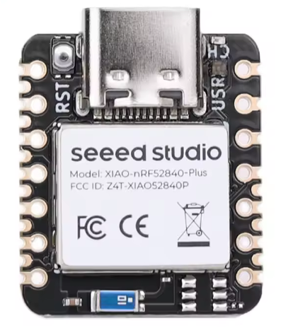

Less half the size of the nice!nano. Pricier for beeing from SeeedStudio. 

#### BEST option but pricier

[XIAO nRF52840 Sense Plus](https://s.click.aliexpress.com/e/_c4FMNzzF)


Just like the other one, but this version comes with an accelerometer inside. The project uses this same accelerometer, so its a win!
If you choosing this one, you can completely skip the soldering of the LSM6DS3.

### Material list

> Little reminder to read the whole guide first before buying anything.

* The controller of your choosing, for this guide [Nice!Nano V2.0](https://s.click.aliexpress.com/e/_c3xJ6Eat)
* [LSM6DS3 if not using XIAO sense plus](https://pt.aliexpress.com/item/1005012449925493.html)
* 6x [two leg tactile button](https://pt.aliexpress.com/item/1005007173900553.html). Honestly, ANY button should work, you can choose the best for you.
* [CR2032 case with switch](https://s.click.aliexpress.com/e/_c3V47s1r)
* [Silicone flexible wires](https://pt.aliexpress.com/item/1005008153169841.html). Can be any wire, i just like slicone wires for beeing resistant.
* [J-LINK only if using NRF52832](https://s.click.aliexpress.com/e/_c40sFFM1) (not gonna be used in this guide)
* [Some thin fabric gloves](https://s.click.aliexpress.com/e/_c2ui0zi9)

## Flashing

The very first step is to flash the firmware to test the board. For that, follow the [Setting up the enviroment](./flashing-guide.md#setting-up-the-environment) guide until the part to flash. It will be needed pioarduino/platformio for this.
Then on visual studio code, add the workspace of the remote controller. The folder is in the protopanda folder at `remote-control\nrfversion`.

Once it loads you will need to select the correct enviroment. For this guide, we're using Nice!Nano, therefore you click on  this option:

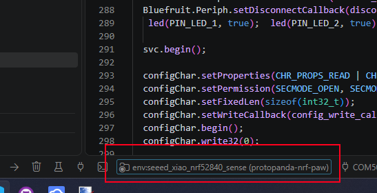

A window will open and you must select the `nice_nano`

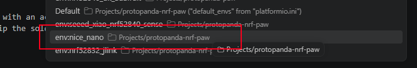

Wait vscode finish configuring and download all the tools. Once ready, plug the board on your computer. It might show as a storage device, if it does not, dont worry its ok too.

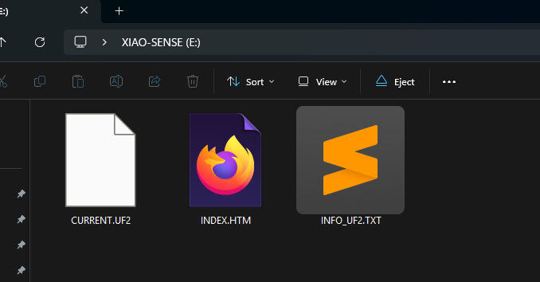

Then you have to click to upload. It will build the project and eventually flash it. 

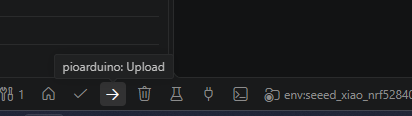

It might fail to flash the first time, pess it again, maybe remove from the usb and plug again, eventually its gonna work unless you got a dead board.

Once flashed you will see a red led that will blink 5 times and then stay on. 
If you're using the XIAO, there are two leds blinking, a red and a blue, then a blue will stay on.

That blinking when powering on indicates the controller failed to find the IMU and will run without transmitting the accelerometer data. We can test it already.

Turn on your protopanda, make sure its in pairing mode

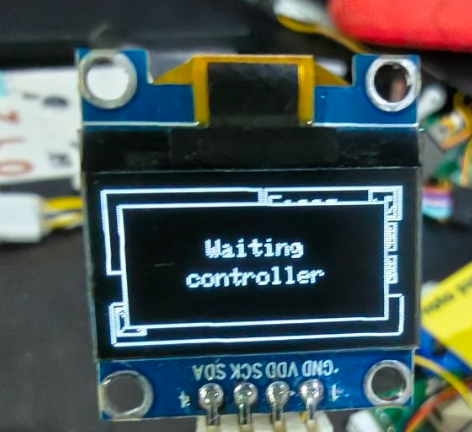

Then it should connect to protopanda. The [X] icon is going to change and the red led on the NRF will occasionally blink.

There you go. You got the controller working, just need to add some buttons and the accelerometer!

## Assembling

For all the parts next, id suggest you download the android APP or use other controller to navigate to a specific part on the menu.

On the main menu, go to `scripts` then search for `control test`. Stay on that script with your protopanda open so you can test. 
Make sure to paired before the controller at least once, because you cant enable the pairing mode while in a script.

If you cant do any of these for the lack of a controller, then edit your init.lua
Find the `onPreflight` function and at the end of it add this:

```lua
scripts.StartScript(8)
```
The number 8 might be changed, open your `misc.json`, search for the `scripts` section and count starting from 1 until you find the 
```json
        {
        "name": "Controls Test",
        "file": "/scripts/controls.lua"
        },
```
If is 8, then all good. If is 7, change 8 to 7.

Upon powering on you should see the control test window.

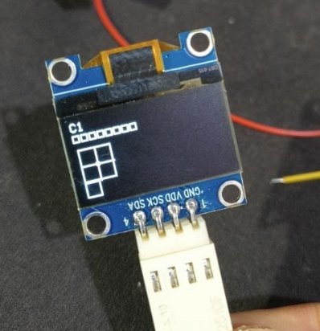

### IMU

Remember, if you got the XIAO sense plus, you can skip this part!

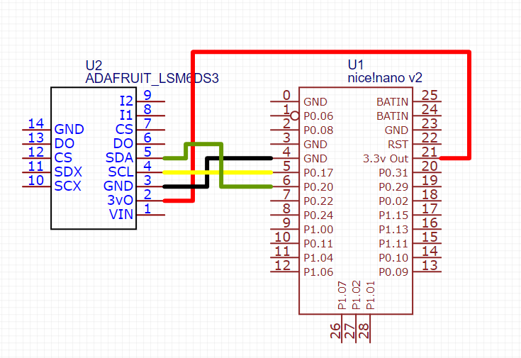

You'll have to wire like the schematic above.

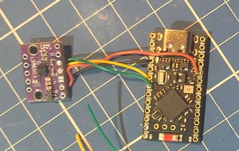

When you turn on the controller now, it should not blink 5 times and on the Control Test script you should see a little line moving asd you wiggle the accelerometer

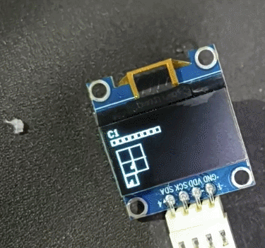

### Battery

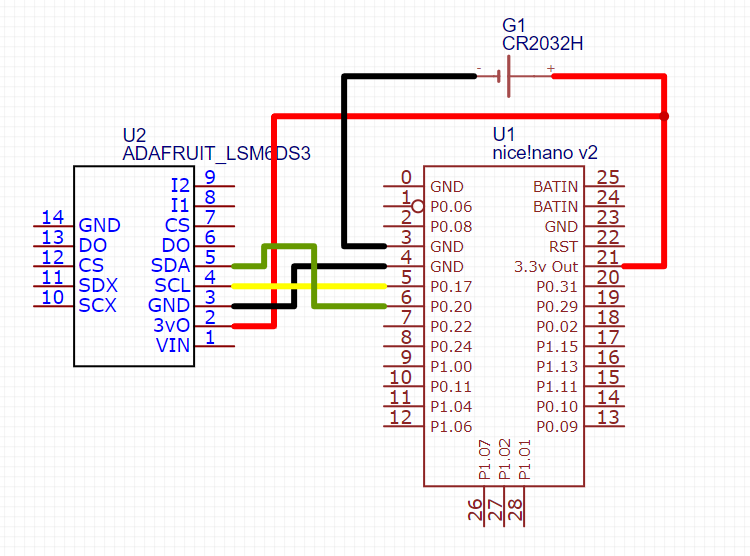

A single CR2032, as some know it "motherboard battery" has more than enough juice to power this tiny boy for a long time. So we're adding that wired socket with a switch to it!

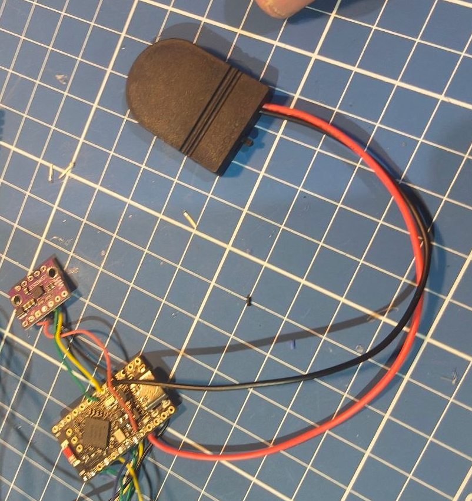

When you put a battery and toggle the switch, it should power on, and connect on the protopanda. 
**Make sure you dont put the battery on the wrong orientation!**

### Button pad

The button pad here is merely a suggestion. 
Want your controller to be a like a TV remote? Go on!
How about one button per finger? Go on!
Its possible to replace the buttons with reed switches? Yep! Its gonna be wierd as f* but yeah.

**All you need to mark a button "pressed" is short GND with the correct GPIO.**

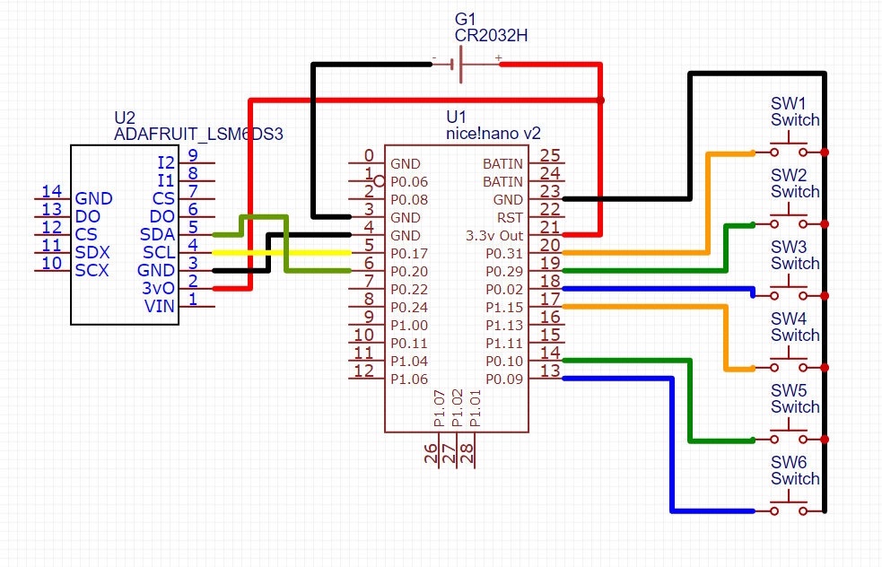

Alternatively if you're using XIAO Sense Plus

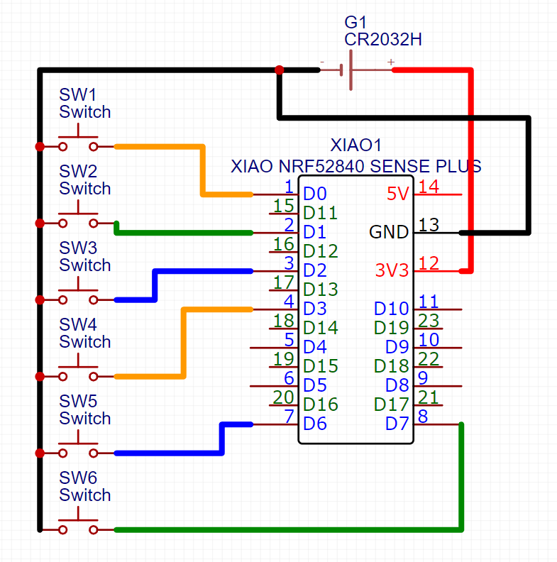

For this guide, i'll be making a little keypad that is attached to the polegar. Lets start with it. You will need a piece of perfboard too.

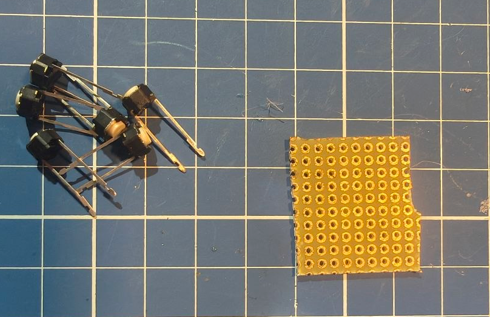

Arrange the buttons on this order

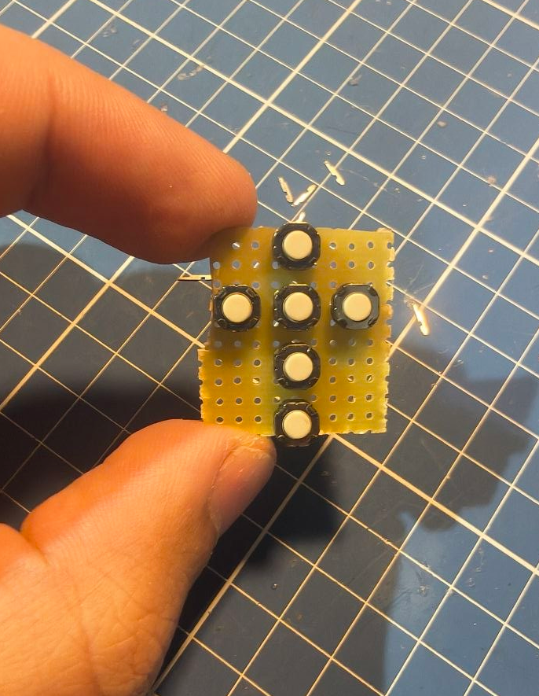

Then we need to bridge all the GND's on the other side

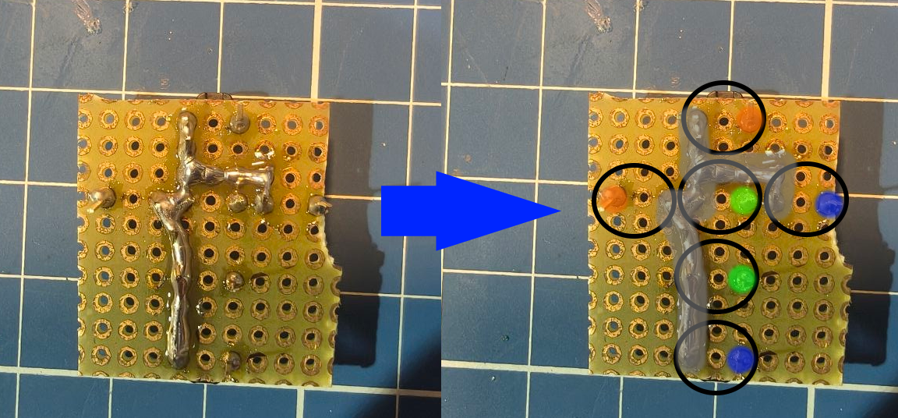

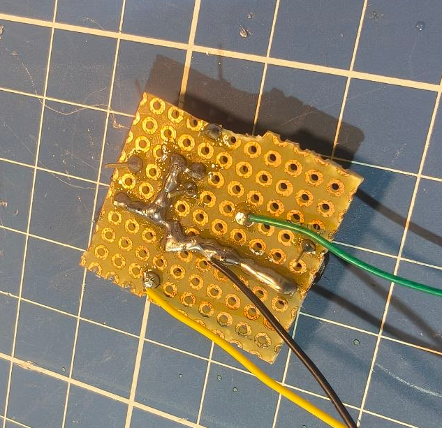

There is a correct orientation and order to wire it.

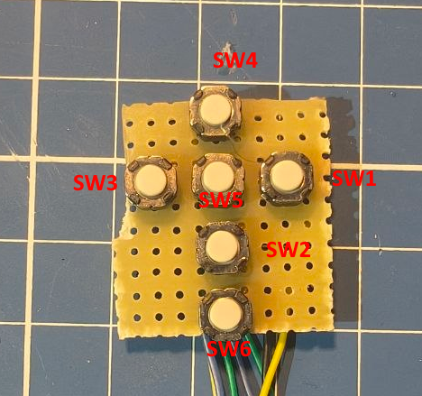
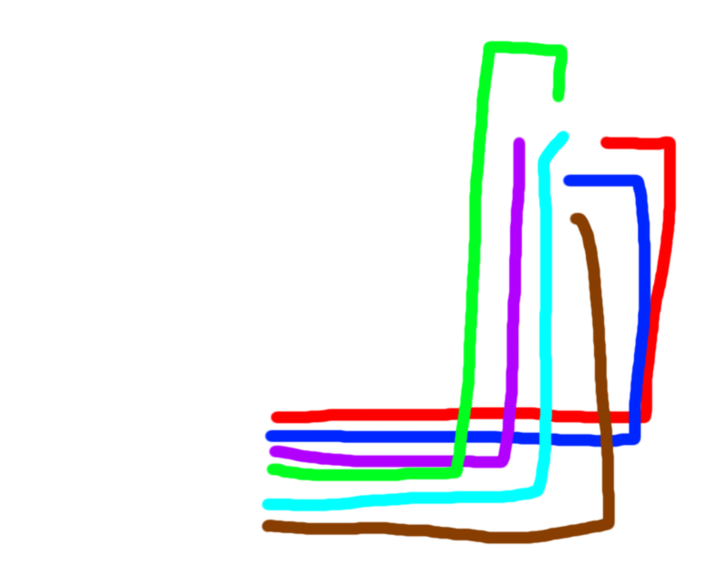

Once everything wired, turn it on and make sure none of the little squares are filled. Press some buttons, each of them should light up one and only one of the squares.
Then check if you wires correctly pressing in order like this gif:

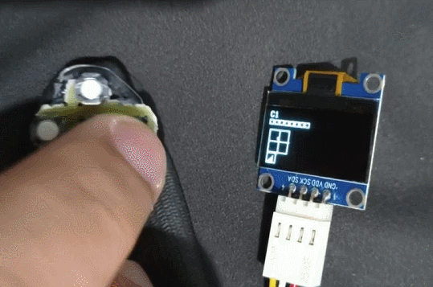

Once its completed, you can remove with some cutting pliers or a dremel the edges and extra pcb around it.

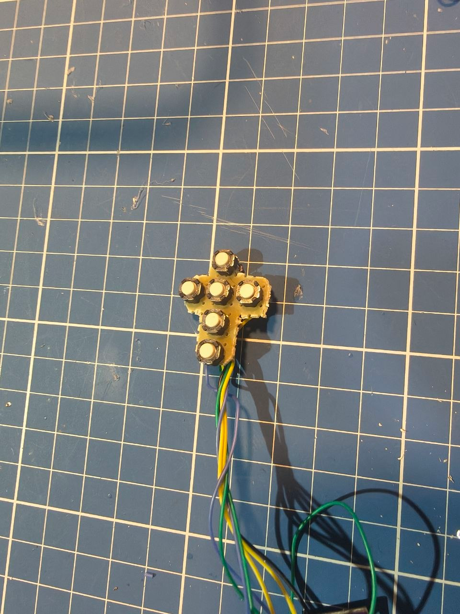

### Gluing on the glove

> On this step make sure no wire goes above or too close to the antenna.

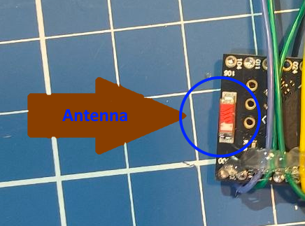

Hands are a thing that move alot and the weakest point in this whole thing we did is where the wire meets the solder. So we need to remove some strain from it.
To do so, lets start with the controller wires. Apply some hot glue on the inner side of the PCB, then fold the wires over them. If necessary apply some on top.

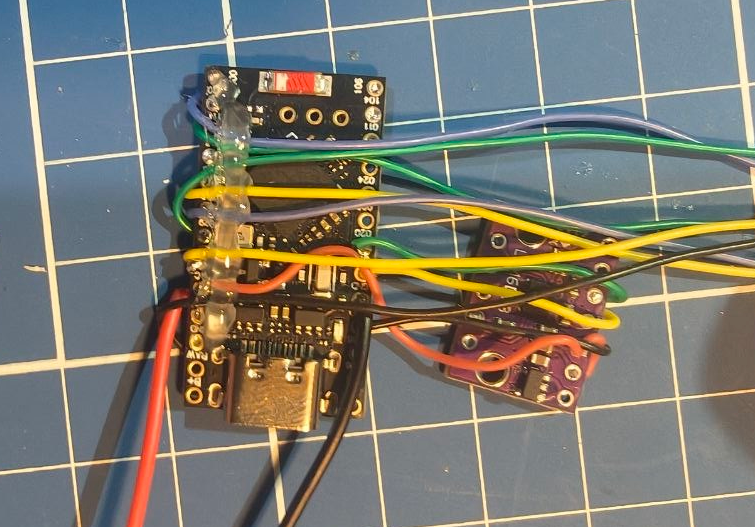

Do this for all the wires if possible. Otherwise they will break in less than a day of use.

This part now is tricky, you might wanna 3d print a hand or fill the glove with something. Personally I like to use my hand on this step, its better but some dexterity is required.

With the glove on hand, put some hot glue (not too hot, make sure you dont burn yourself) on the polegar and stick the keypad there.

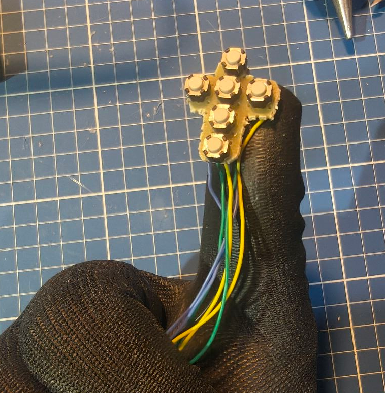

Pass the wires between the polegar and the index finger, put the controller on this orientation. Add hot glue to keep it in place, only a bit to hold in place for now.


Once it cools, add glue little by little on both the keypad, controller and accelerometer until they're attached really well. 
 
> BE CAREFUL TO NOT SPILL HOT GLU ON THE USB PORT

Now if you leave like this, there will be alot of strain in a single point of the wire, and the wire will be all over the place. To avoid that lets add some strain relifes and anchor points to the wires.

Like on the photo, add a dash of hot glue, then tidy the wires on it, add a bit on top and hold in place while it cools down:

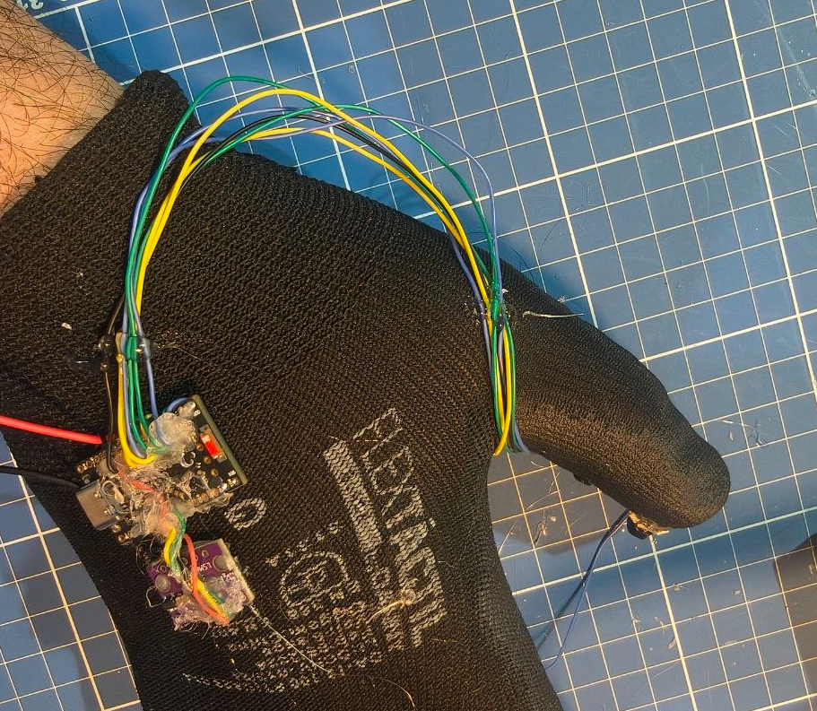

Do this for at least 3 points of the keypad wire, and two for the battery wires.

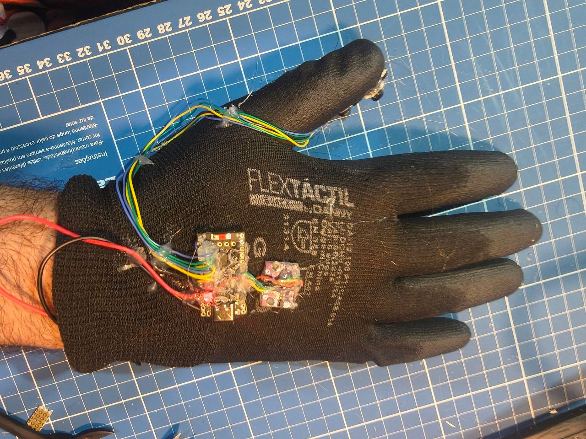

Make sure that all wires that are connected to the PCB have some strain releif point and when you move your hand **no wire on the solder joins move**.

For the battery, the specific holder i got dont like to be glued, so i just leave it dangling or shove inside the glove.

Once the glove is completed, you can build your protogen glove over this glove, just leave a hole for the polegar keypad. You operate using a pinch movement between the index and the polegar.
As mentioned before, depending on your goal or needs, you can use bigger buttons, one button per finger, move the keypad to the top of the hand or even use it like a watch.
